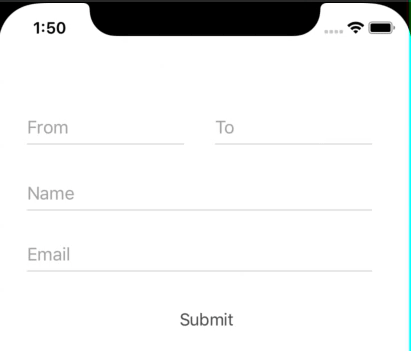
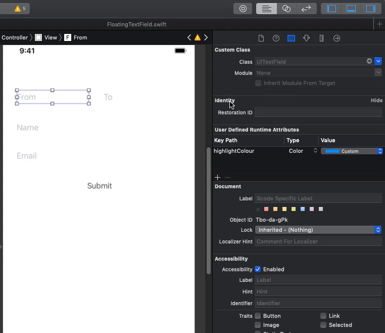

# FloatingTextField

**FloatingTextField** is an easy and customizable implementation of the space saving "Float Label Pattern" written 100% in Swift.
This design enables adding context to input fields that are visible at the time of typing, 
while minimizing the additional space used to display this additional context. 

## Usage via Interface Builder

No need to download any cocoapod. Just download **FloatingTextField.swift** file and use in your project. 
1. Change textfield class via Interface Builder, to FLoatingTextField.
2. Set your custom highlighted colour in IB. 
3. Set your placeholder text that floating label should show. 

## Author
Abhishek Rathi, work.abhirathi@gmail.com

## License
FloatingTextField is available under the MIT license. See the LICENSE file for more info.
